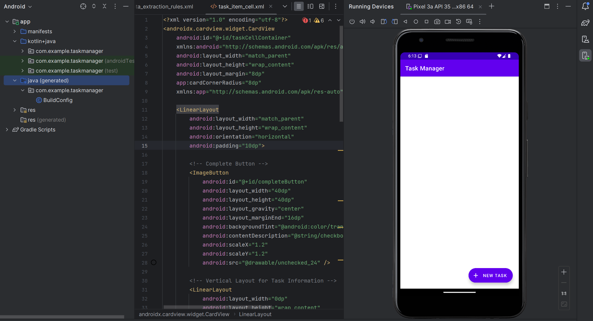
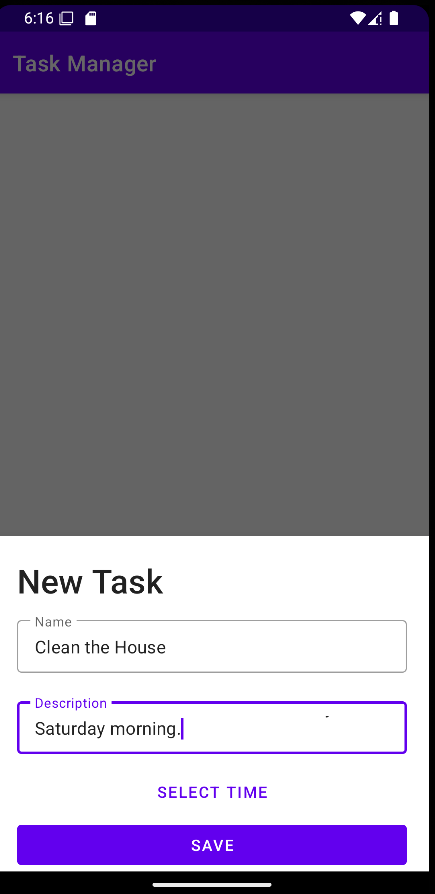
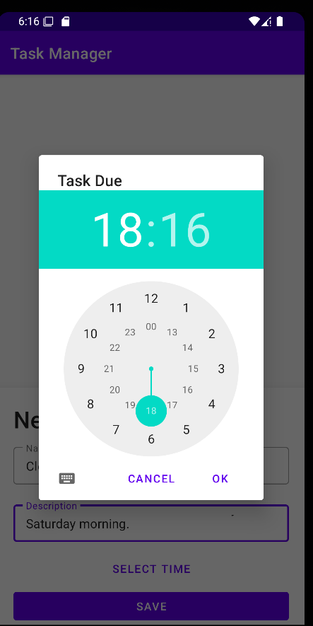
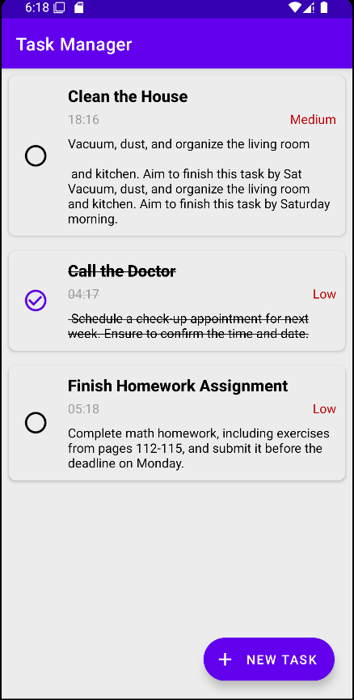
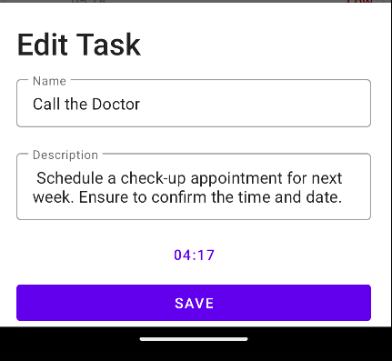
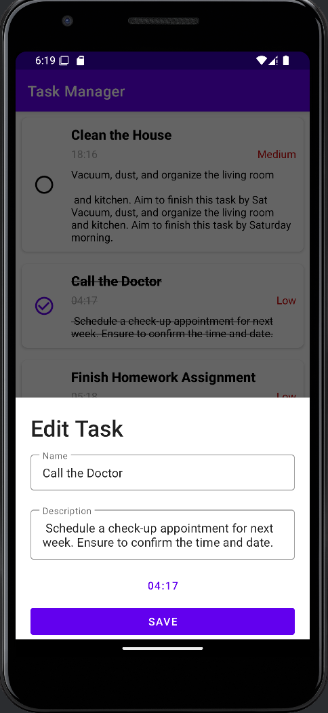

# Task Management App

## Project Overview

The Task Management App is a simple yet powerful application designed to help users manage their tasks efficiently. Users can add tasks, assign due dates, set priorities, and mark tasks as completed. The tasks are displayed in a visually organized card format. This app is perfect for users who want to keep track of their tasks on a daily basis.

---
### Prerequisites
*   Android Studio 
*   Java JDK

## 📃 Libraries used
- [Kotlin](https://kotlinlang.org/) - First class and official programming language for Android development.
- [Coroutines](https://kotlinlang.org/docs/reference/coroutines-overview.html) - For asynchronous and more..
- [Room](https://developer.android.com/topic/libraries/architecture/room) - SQLite object mapping library.
- [RecyclerView](https://developer.android.com/jetpack/androidx/releases/recyclerview) - Display large sets of data in your UI while minimizing memory usage.
- [Material Components for Android](https://github.com/material-components/material-components-android) - Modular and customizable Material Design UI components for Android.
- [ViewBinding](https://developer.android.com/topic/libraries/view-binding) - Generates a binding class for each XML layout file present in that module and allows you to more easily write code that interacts with views.

## Key Features
- **Task Creation**: Users can create new tasks by entering a task name, description, due date, and priority (high, medium, or low).
- **Task List**: Displays tasks in a list with indicators for completed and pending tasks.
- **Task Completion**: Users can mark tasks as complete, striking them through.
- **Priority Settings**: Tasks can be set with different priorities (high, medium, low), and colors are assigned based on the priority level.
- **Task Editing**: Users can edit task details including name, description, due date, and priority.

- **Persistent Data**: All tasks are saved, so even when the app is closed, tasks are maintained.

---
## Explanation of Key Features

- **Task Creation**: This feature allows users to create new tasks by entering essential details such as task name, description, due date, and priority level (high, medium, or low). This ensures that each task is well-organized and easily manageable, enhancing overall productivity.

- **Task List**: The app presents all tasks in a straightforward list view, enabling users to quickly view both completed and pending tasks. Tasks are visually distinguished based on their completion status, allowing for a clear overview of ongoing responsibilities.

- **Task Completion**: Users can mark tasks as complete with a simple click on the checkbox icon. Completed tasks are visually represented with a strikethrough effect, providing immediate feedback and helping users track their progress effectively.

- **Priority Settings**: Each task can be assigned a priority level, which is visually represented with different text colors. This feature helps users to prioritize their tasks, allowing them to focus on the most important ones first, thereby improving task management.

- **Task Editing**: Users have the flexibility to edit their tasks at any time. They can modify details such as the task name, description, due date, and priority. This feature ensures that users can adapt their task lists to reflect any changes in their plans or circumstances.


- **Persistent Data**: All task data is saved persistently on the user’s device. This means that even if the app is closed, tasks remain saved and accessible. This feature ensures that users do not lose any task information between sessions, making the app reliable for long-term use.


## 🔨Setup Instructions

Follow this steps to get Working Project!
```
1. Clone this repository or download file
2. Extract zip if downloaded code
3. Open project in Android Studio
4. Wait while Android Studio Download gradle or required files
5. Hit Run Button !
```

## ✨ Screenshots

<div style="display:flex;">




</div>
<br>
<div style="display:flex;">


</div>
